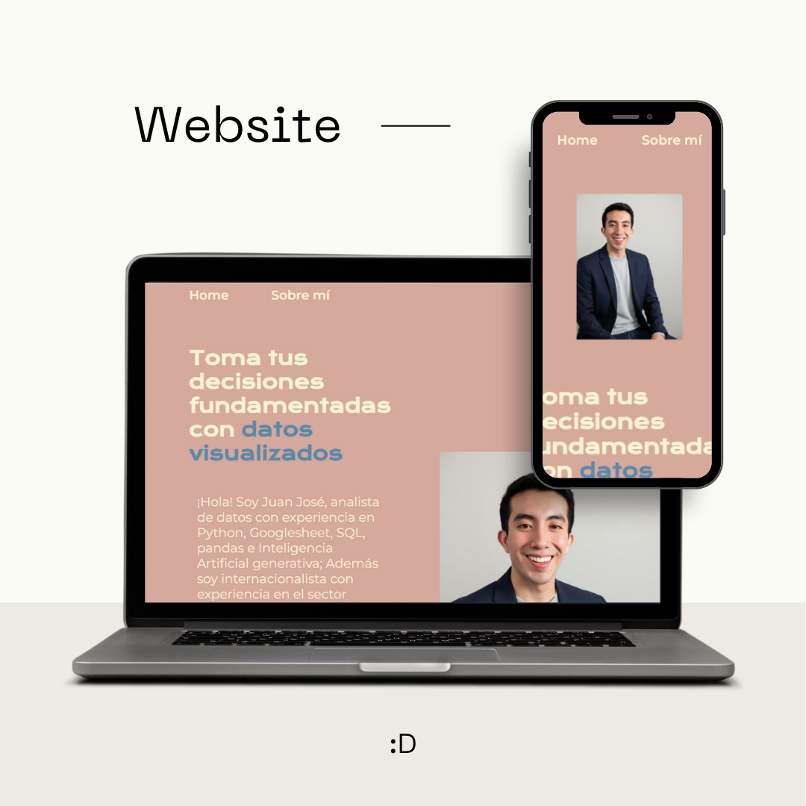

<h1>🌐 Portafolio Personal</h1>

¡Bienvenidos a mi portafolio!
Este proyecto es mi carta de presentación profesional. Aquí comparto un poco sobre mí, mi experiencia en datos y enlaces directos a mi LinkedIn
y GitHub.

🛠️ Tecnologías usadas

HTML5 – para la estructura de la página

CSS3 – para el diseño y la responsividad

📱 Características

✅ Diseño Responsivo – se adapta a distintos dispositivos
✅ Menú Interactivo – navegación entre Home y Sobre mí
✅ Estilo Sencillo y Limpio – fácil de leer y navegar

📸 Vista previa

Aquí podrías poner una captura de pantalla de tu portafolio

🚀 Cómo verlo:

Puedes visitar el proyecto en línea:
🔗 [Ver Portafolio](https://portafolio-cyan-sigma.vercel.app/index.html)

O clonar el repositorio y abrir el archivo index.html en tu navegador:

git clone https://github.com/tuusuario/tu-repo.git](https://github.com/jossxopa/portafolio.git)

📬 Conecta conmigo

Si te interesa colaborar o tienes feedback, puedes encontrarme en:

[LinkedIn](https://www.linkedin.com/in/juanjoseromeroxopa/)

[GitHub](https://github.com/jossxopa/portafolio.git)
